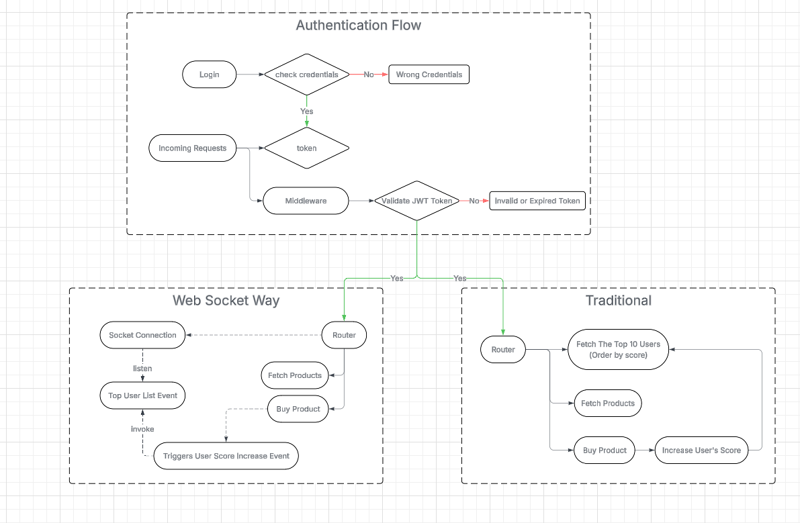
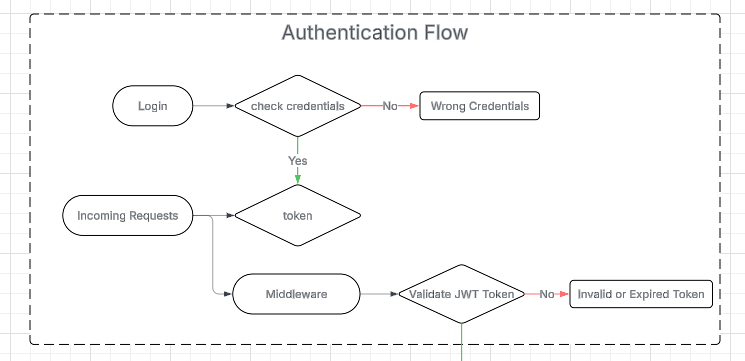
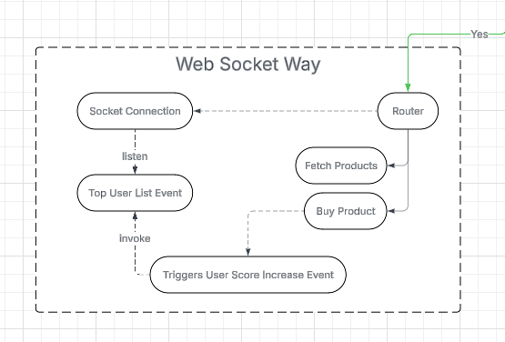

# Score Board Code Test


The problem is about having an Live updates of users' score board.

To have this real time effect, we must use WebSocket.

I have created simple endpoints and tables to demonstrate this problem better.

With Normal approach when a user buys a product, 
the record will go into user's purchase_history table, which in this example called UserProduct.

Right after saving that, backend will go increase the user's score,
via another api or in the same service above.

This way other users will not get their the score board updated unless they reload the page.

With the help of WebSocket, right after a successful login, we can start connect to WebSocket
and listen to the event that returns the top 10 users.

And after whoever buys the product, we will increase his score and, emit to that event, 
letting the event knows that, someone has bought something and his score got updated, you need to reload again.

Then the WebSocket will do its job, and brings you freshest top 10 users from the connection you called after login.

I have provided 4 flow charts to show the flow of the problem in different ways.

## Flow Chart

### Auth Flow

### Tridional Flow

### Web Socket Flow


## Endpoints

### Login
#### Request
```http
POST http://localhost:5000/api/auth/login

{
    "email" : "user.mail@example.co",
    "password" : "Password123!"
}

```
#### Response 
```javascript
200 
    {
        "token" : "hashed_token"
    }
```

### Get All Products
#### Request
```http
GET http://localhost:5000/api/products

header : 
{
    "authorization" : "Bearer ${token}"
}
```
#### Response 
```javascript
200 
    {
        "products": [
            {
                "id": 1,
                "name": "Product 1",
                "price": 19.99
            },
            {
                "id": 2,
                "name": "Product 2",
                "price": 29.99
            }
        ]
}

401 
    {
       "error" : "invalid or expired token."
    }
```

### Get Top 10 Users
#### Request
```http
GET http://localhost:5000/api/users?orderBy=score&orderType=desc

header : 
{
    "authorization" : "Bearer ${token}"
}
```
#### Response 
```javascript
200 
    {
        "users": [
            {
                "id": 1,
                "email": "user1.mail@example.co",
                "score": 10
            },
            {
                "id": 2,
                "email": "user2.mail@example.co",
                "score": 9
            }
        ]
    }

401 
    {
       "error" : "invalid or expired token."
    }
```

### User Buy Product
#### Request 
```http
POST http://localhost:5000/api/products/buy/${productId}

header : 
{
    "authorization" : "Bearer ${token}"
}
```

#### Business Logic (for tradional flow) 
```javascript
const product = await productRepo.findById(productId);

if(!product) Throw new NotFoundError(`Product with id: ${productId} not found.`)

await transaction(tx){
    tx.userProductRepo.save(currentUserId, product.id, product.price);
    tx.userRepo.update(currentUserId, score: ++score );
}
```

#### Business Logic (for web socket flow) 
```javascript
//user service
const product = await productRepo.findById(productId);

if(!product) Throw new NotFoundError(`Product with id: ${productId} not found.`)

tx.userProductRepo.save(currentUserId, product.id, product.price);

event.emit('user.buy.product');


//socket service
socket.on("connection", (socket) => {

    event.emit('top.10.users');

})

socket.subscribe('top.10.users', () => {

    const top10Users = userRepo.getTop10Users();

    event.emit('top.10.users', top10Users);

});

socket.on('user.buy.product', () => {

    userRepo.update(currentUserId, score: ++score );

    event.emit('top.10.users');
});


```

#### Response 
```javascript
200 
    {
       "message" : "Success."
    }

401 
    {
       "error" : "invalid or expired token."
    }

404 
    {
       "error" : "Product with id: ${productId} not found."
    }
```
